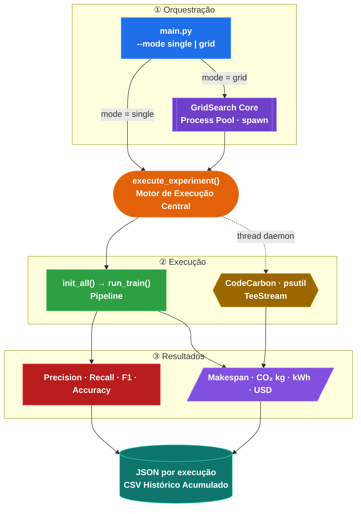

# GridSearch Skyband: Otimização de Hiperparâmetros para Modelos de Linguagem


Para executar no **Google Colab**, acesse:

- [](https://colab.research.google.com/drive/1ptcAKCC_f7lX5y9B_zJ3iisO11W1Ny2K)

## Instalação

O projeto usa [`uv`](https://docs.astral.sh/uv/) como gerenciador de ambiente e dependências. O `requirements.txt` presente no repositório é gerado automaticamente — **não o edite diretamente**; a fonte de verdade é o `pyproject.toml`.

### Pré-requisitos

- Python ≥ 3.11
- [`uv`](https://docs.astral.sh/uv/getting-started/installation/) instalado
- (Opcional) NVIDIA GPU com CUDA 12.8 para aceleração

### Passos

```bash
# 1. Clone o repositório
git clone https://github.com/gassantos/gridsearch-skyband.git
cd gridsearch-skyband

# 2. Crie o ambiente virtual e instale as dependências de produção
uv sync

# 3. (Opcional) Instale também as dependências de desenvolvimento (pytest, etc.)
uv sync --group dev
```

> **Plataforma Linux (CUDA 12.8):** o `pyproject.toml` já configura automaticamente o índice `pytorch-cu128`. Em macOS/Windows, o índice `pytorch-cpu` é selecionado sem necessidade de configuração adicional.

### Verificar instalação

```bash
uv run python -c "import torch; print(torch.__version__, '| CUDA:', torch.cuda.is_available())"
```

---

## Testes

A suite de testes cobre os componentes críticos do pipeline de treinamento (101 testes pytest).

```bash
# Suite completa
uv run --group dev pytest

# Com relatório de cobertura por módulo
uv run --group dev pytest --cov=. --cov-report=term-missing

# Arquivo específico
uv run --group dev pytest tests/test_optimizer.py -v

# Classe específica
uv run --group dev pytest tests/test_warmup_scheduler.py::TestSchedulerLRBehavior -v
```

| Arquivo de teste | Cobertura |
|---|---|
| `test_optimizer.py` | Tipos e hiperparâmetros de todos os otimizadores (Adam, AdamW, SGD, bert_adam) |
| `test_warmup_scheduler.py` | Cálculo de steps, comportamento de LR no warmup/decaimento, restauração de estado |
| `test_checkpoint.py` | Chaves obrigatórias, round-trip do warmup scheduler, `trained_epoch` e `global_step` |
| `test_init_tool_state.py` | Carregamento de estado em `init_all`, tolerância a checkpoint inválido |
| `test_gridsearch.py` | Geração de grade, validação de memória, filtragem de config, análise de resultados |
| `test_gridsearch_config.py` | Estrutura e naming dos arquivos JSON de configuração do grid |

---

## Pipeline de Funcionamento



---

## Executando Experimentos Rastreáveis

Para pesquisa e reprodutibilidade, use `main.py` como ponto de entrada único. Ele orquestra tanto experimentos individuais quanto busca em grade de hiperparâmetros, delegando a execução ao motor `run_experiment.py`.

### Arquitetura de execução

```
main.py  ──(mode=single)──→  run_experiment.py  →  tools/train_tool.py
         ──(mode=grid)────→  gridsearch/core.py  →  run_experiment.py
```

### Experimento único

```bash
# Execução padrão (usa config/experiments/BertPLI.config)
uv run python -m main --mode single

# Com configuração específica
uv run python -m main --mode single --config config/experiments/BertPLI2.config

# Diretamente pelo motor (com seleção de GPU)
uv run python run_experiment.py config/experiments/BertPLI.config        # GPU auto
uv run python run_experiment.py config/experiments/BertPLI.config 0      # GPU 0
uv run python run_experiment.py config/experiments/BertPLI.config 0 1    # GPU 0+1
```

### Grid search de hiperparâmetros

```bash
# Busca minimal (teste rápido — 8 combinações, 2 workers)
uv run python -m main --mode grid \
    --grid-config gridsearch/config/grid_search_test.json \
    --parallel 2

# Busca completa (produção — 216 combinações)
uv run python -m main --mode grid \
    --grid-config gridsearch/config/grid_search.json \
    --parallel 4

# Retomar execução interrompida
uv run python -m main --mode grid --resume
```

> **Distribuição de GPUs:** em modo paralelo, o `main.py` distribui os workers em round-robin pelas GPUs disponíveis de forma automática. Para controle explícito, use `run_experiment.py` diretamente.

### Artefatos gerados

Cada experimento produz automaticamente em `output/experiments/metrics/`:

| Artefato | Descrição |
|---|---|
| `<nome>_<optimizer>_<lr>_<bs>_<ep>_<timestamp>.json` | Métricas completas do experimento em JSON |
| `experiment_summary_<YYYYMMDD>.csv` | Agregação diária de todos os experimentos |
| `EmissionsCO2_<device>_<YYYYMMDD>.csv` | Emissões de CO₂ rastreadas pelo `codecarbon` |

O JSON por experimento contém as seções:

```json
{
  "experiment":      { "id", "config_name", "seed", "status", "timestamp_start", "timestamp_end" },
  "environment":     { "device_type", "device_name", "precision" },
  "hyperparameters": { "optimizer", "learning_rate", "batch_size", "epoch", "avg_gflops_per_batch" },
  "resources":       { "train_time_sec", "energy_kwh", "emissions_kg_co2", "avg_ram_mb", "peak_ram_mb", "total_gflops" },
  "evaluation":      { "precision", "recall", "f1_score", "source" },
  "logs":            { "stdout_tail", "stderr_tail" }
}
```

### Ativando avaliação automática ao final do treino

No arquivo `.config` do experimento, inclua a seção:

```ini
[eval]
run_test_at_end = true

[data]
test_labels_file = data/task1_test_labels_2024.json
```

### Rastreamento de Emissões de CO₂

O projeto integra o [`codecarbon`](https://mlco2.github.io/codecarbon/) para medir consumo
energético e emissões de CO₂ a cada experimento executado.

**Ativar no arquivo `.config` do experimento:**

```ini
[monitoring]
enable_monitoring = true
```

Quando ativado, ao término do experimento:

| Saída | Descrição |
|-------|-----------|
| Campo `energy_kwh` no JSON | Energia consumida em kWh |
| Campo `emissions_kg_co2` no JSON | Emissões estimadas em kg CO₂ |
| `output/experiments/metrics/EmissionsCO2_<device>_<YYYYMMDD>.csv` | Histórico acumulado de emissões |

**Custo estimado de energia**

O custo monetário é calculado com a tarifa padrão de **$0,12 USD/kWh**, configurável via variável de ambiente:

```bash
ENERGY_COST_USD_PER_KWH=0.08 uv run python run_experiment.py config/experiments/BertPLI.config
```

> A variável `ENERGY_COST_USD_PER_KWH` aceita qualquer valor em ponto flutuante (USD por kWh).
> O resultado aparece no campo `energy_cost_usd` do JSON de métricas do experimento.

---

This repository contains the code for BERT-PLI in our IJCAI-PRICAI 2020 paper: *BERT-PLI: Modeling Paragraph-Level Interactions for Legal Case Retrieval*.

---

## Busca em Grade de Hiperparâmetros (Grid Search)

O módulo `gridsearch/` implementa busca exaustiva de hiperparâmetros com execução paralela, rastreamento de recursos e análise automática dos resultados.

### Modos de execução

**Via `main.py` (recomendado):**

```bash
# Grade de teste — 8 combinações, validação rápida do pipeline (~2-3h com 2 workers)
uv run python -m main --mode grid \
    --grid-config gridsearch/config/grid_search_test.json \
    --parallel 2

# Grade completa — 432 combinações (~72-108h com 2 workers)
uv run python -m main --mode grid \
    --grid-config gridsearch/config/grid_search.json \
    --parallel 4

# Retomar execução interrompida (checkpoint automático por experimento)
uv run python -m main --mode grid --resume
```

**Via módulo `gridsearch` (uso programático):**

```python
from gridsearch import run_grid_search, analyze_results
import json

with open("gridsearch/config/grid_search_test.json") as f:
    grid_config = json.load(f)

results = run_grid_search(
    base_config_path="config/experiments/BertPLI.config",
    grid_config=grid_config["hyperparameters"],
    parallel=2,
    gpu_ids=[0, 1],   # distribuição round-robin por worker
)

analysis = analyze_results(results)
```

### Espaço de busca

| Hiperparâmetro | Valores (grade completa) |
|---|---|
| `learning_rate` | `1e-5`, `2e-5`, `3e-5`, `5e-5` |
| `batch_size` | `8`, `16`, `32` |
| `optimizer` | `adam`, `adamw`, `sgd`, `bert_adam` |
| `dropout` | `0.1`, `0.2`, `0.3` |
| `seed` | `42`, `123`, `456` |
| **Total** | **432 combinações** |

### Artefatos gerados

```
output/experiments/grid_search/
├── grid_search_results_<data>.json    # Resultados de todos os experimentos
├── grid_search_summary_<data>.txt     # Ranking legível das melhores configurações
└── grid_search_state_<data>.json      # Estado para retomada (--resume)
```

O módulo analisa e ranqueia as configurações por 5 critérios:
tempo de treinamento, consumo de energia (kWh), emissões de CO₂ (kg),
uso de RAM (MB) e F1-score de validação.

> Para documentação completa do módulo, consulte [`gridsearch/README.md`](gridsearch/README.md).

---

## Estrutura do Projeto

```
📁 ExperimentoBERT-PLI/
│
├── 📄 main.py                 Orquestrador do experimento
├── 📄 run_experiment.py       Motor de execução
├── 📄 pyproject.toml          Dependências e entrypoints
├── 📄 compose.yaml            Ambiente containerizado
├── 📄 Dockerfile              Imagem base do projeto
├── 📁 config/                 Configurações em cascata
├── 📁 model/                  Modelos LM
├── 📁 formatter/              Preparação de inputs
├── 📁 dataset/                DataLoaders
├── 📁 tools/                  Treino, Avaliação e Inferência
├── 📁 scripts/                Entrypoints CLI
├── 📁 gridsearch/             Módulo de busca em grid
├── 📁 utils/                  Utilitários gerais
├── 📁 tests/                  Suite com 101 testes
├── 📁 data/                   Dados sintéticos
├── 📁 examples/               Exemplos de dados
├── 📁 docs/                   Documentação técnica
└── 📁 devconteiner/           Dev Container (VS Code)
```

### Exemplos de formato de dados

> **Para fins acadêmicos:** Este repositório inclui dados sintéticos de casos jurídicos no diretório `data/`, simulando a estrutura do dataset COLIEE:
>
> - 34 pares de parágrafos para treino (exemplos positivos e negativos balanceados)
> - 6 pares de parágrafos para validação
> - 10 documentos com múltiplos parágrafos para teste
> - Conteúdo jurídico realista cobrindo diversos temas (contratos, direito constitucional, processo civil, etc.)
>
> **Para pesquisa/produção:** acesse [COLIEE 2019](https://sites.ualberta.ca/~rabelo/COLIEE2019/) para solicitar o dataset original da competição.

- [examples/task2/data_sample.json](examples/task2/data_sample.json): input para Estágio 2 (fine-tuning par de parágrafos)

```json
{ "guid": "queryID_paraID", "text_a": "<parágrafo decisão>", "text_b": "<parágrafo candidato>", "label": 0 }
```

- [examples/task1/case_para_sample.json](examples/task1/case_para_sample.json): input para Estágio 3 (BertPoolOutMax)

```json
{ "guid": "queryID_docID", "q_paras": ["..."], "c_paras": ["..."], "label": 0 }
```

- [examples/task1/embedding_sample.json](examples/task1/embedding_sample.json): input para Estágio 4 (AttenRNN)

```json
{ "guid": "queryID_docID", "res": [[...], ...], "label": 0 }
```

### Dependências

- Gerenciadas via `pyproject.toml` + `uv`. Consulte a seção [Instalação](#instalação) para instruções completas.
- Para inspecionar as versões exatas resolvidas: `uv pip list`

## Reprodutibilidade

O projeto garante resultados reproduzíveis por meio da função `set_seed` em [utils/seed.py](utils/seed.py), que cobre todas as fontes de aleatoriedade:

| Camada | Mecanismo |
|--------|-----------|
| Python | `random.seed(seed)` |
| Python hash | `PYTHONHASHSEED=<seed>` |
| NumPy | `np.random.seed(seed)` |
| PyTorch CPU | `torch.manual_seed(seed)` |
| PyTorch CUDA | `torch.cuda.manual_seed_all(seed)` |
| cuDNN | `deterministic=True`, `benchmark=False` |
| Apple Silicon (MPS) | `torch.mps.manual_seed(seed)` |
| Transformers | `transformers.set_seed(seed)` |

### Configurando o seed pelo arquivo `.config`

```ini
[training]
seed = 42
```

O seed padrão é `42`. Para máxima reprodutibilidade, use `ensure_reproducibility()`, que adicionalmente define `CUBLAS_WORKSPACE_CONFIG=:4096:8`:

```python
from utils.seed import ensure_reproducibility
ensure_reproducibility(seed=42)
```

### Trade-off: determinismo vs. performance

| Modo | `cudnn.deterministic` | `cudnn.benchmark` | Performance |
|------|----------------------|-------------------|-------------|
| `set_seed(seed, deterministic=True)` *(padrão)* | `True` | `False` | Reduzida |
| `set_seed(seed, deterministic=False)` | `False` | `True` | Máxima |

> **Nota:** mesmo com `deterministic=True`, operações atômicas em GPU (ex.: `scatter_add`) podem introduzir variação residual em versões mais antigas do CUDA. Para eliminação total, use `ensure_reproducibility()`.

---

